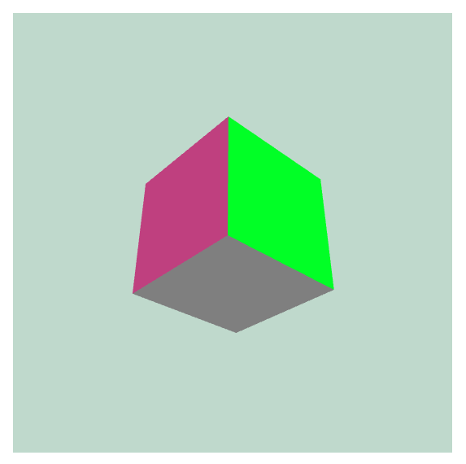

# WebGL Shader Starter

A modern (Snowpack + Typescript) base for starting a raw 3D WebGL project using GLSL shaders.

Upon starting you will see a 3D rotating (on 2 axes) cube.

Code is based on the following YouTube tutortials:

- Part 1 (static triangle): https://www.youtube.com/watch?v=kB0ZVUrI4Aw
- Part 2 (rotating cube): https://www.youtube.com/watch?v=3yLL9ADo-ko

## Available Scripts

### yarn start

Runs the app in the development mode.
Open http://localhost:8080 to view it in the browser.

The page will reload if you make edits.
You will also see any lint errors in the console.

### yarn build

Builds a static copy of your site to the `build/` folder.
Your app is ready to be deployed!

**For the best production performance:** Add a build bundler plugin like [@snowpack/plugin-webpack](https://github.com/snowpackjs/snowpack/tree/main/plugins/plugin-webpack) or [snowpack-plugin-rollup-bundle](https://github.com/ParamagicDev/snowpack-plugin-rollup-bundle) to your `snowpack.config.json` config file.

### Q: What about Eject?

No eject needed! Snowpack guarantees zero lock-in, and CSA strives for the same.

## Dev tools

Install (Shader languages support for VS Code)[https://marketplace.visualstudio.com/items?itemName=slevesque.shader] for VS Code syntax highlighting of `.glsl`.
